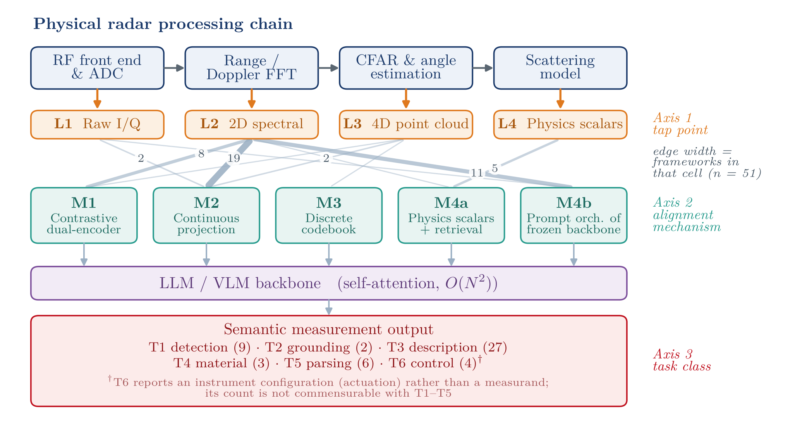
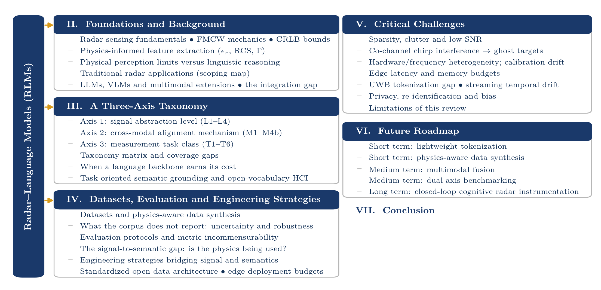
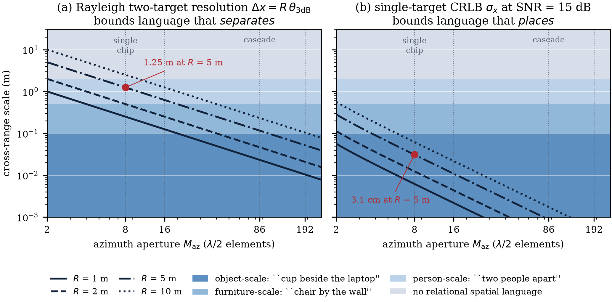
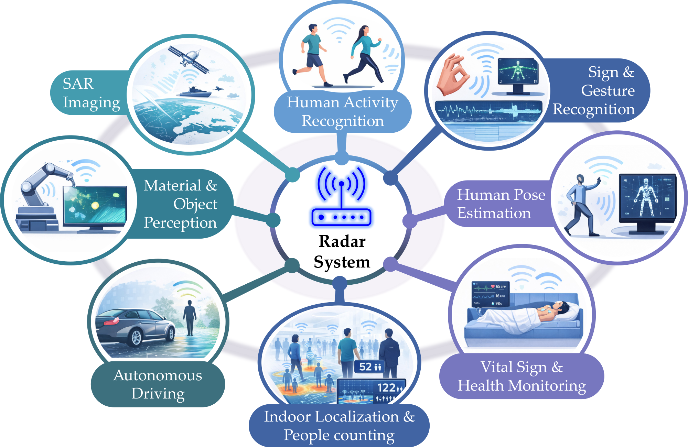

# 📡 Radar Signals in the Large Language Era: A Systematic Review of Aperture Bounds, Uncertainty Reporting, and Embedded Deployment

[](https://ieeexplore.ieee.org/xpl/RecentIssue.jsp?punumber=19)
[-green.svg)](./code/corpus.py)
[](./code/prisma_assessment.csv)
[](./code)
[](./LICENSE)

**Official repository** for the IEEE Transactions on Instrumentation and Measurement (IEEE TIM) survey manuscript:  
**"Radar Signals in the Large Language Era: A Systematic Review of Aperture Bounds, Uncertainty Reporting, and Embedded Deployment"**

**Authors**: [The Tuan Trinh](https://orcid.org/0009-0009-7459-3797), [Khoa Nguyen Dang](https://orcid.org/0000-0002-6525-5245), [Xuanque Nguyen](https://orcid.org/0009-0001-2635-6553), [Minhhuy Le](https://orcid.org/0000-0001-6152-6215)\*  
*\*Corresponding author: M. Le (`huy.leminh@phenikaa-uni.edu.vn`)*  
*Faculty of Electrical and Electronic Engineering, PHENIKAA School of Engineering, PHENIKAA University, Hanoi, Vietnam*

---

## 📌 Abstract

Radar instrumentation measures range, Doppler velocity, angle of arrival, and material dielectric properties through adverse environments without optical privacy intrusion. Coupling radar signal processing chains to language models turns fixed-dictionary classifiers into open-vocabulary measurement systems. We systematically audit **51 radar-language frameworks** retrieved under a PRISMA-guided protocol from 1,600+ records (2020–2026), evaluating signal representations ($L1$–$L4$), cross-modal alignment mechanisms ($M1$–$M4b$), and measurement task classes ($T1$–$T6$). Four findings emerge:

1. **The 63.6% L2a Collapse**: Of the 33 instrumentation-side frameworks whose authors held coherent data, **63.6% (21/33)** still collapse the backscatter tensor into a 2D product to reuse optical vision encoders (CLIP, LLaVA, ViT), permanently discarding phase coherence ($2\pi f_c \tau_m$) and polarimetric fidelity.
2. **Aperture Bounds vs. RF Bandwidth**: Under conventional beamforming, descriptive spatial granularity is strictly bounded by array aperture rather than RF bandwidth ($1.3\,\text{m}$ azimuth against $5\,\text{cm}$ range resolution at $5\,\text{m}$ on single-chip MIMO arrays); a bound subspace superresolution relaxes only at an SNR and snapshot cost no surveyed framework reports. Resolvable state capacity ($N_{\mathrm{states}} \propto B f_c M T_{\mathrm{obs}}$) governs spatial detail and biometric identifiability alike.
3. **The 0/51 Reporting Gap (Uncertainty & Calibration)**: Under a 4-item rubric, **no surveyed framework** reports a GUM-compliant uncertainty budget, calibration standard/residual, phase-noise tolerance, or input SNR sensitivity curve on a physical measurand, and none propagates input SNR to the semantic output. We provide a worked GUM budget for permittivity inference ($\epsilon_r = 4$, $U_{95} = 1.59$) as the minimum viable template.
4. **Embedded Edge Feasibility**: Contrastive alignment ($M1$, 9 frameworks) is the **only paradigm admitting decoder-free microcontroller deployment** against precomputed label dictionaries, whereas run-time open-vocabulary querying requires edge GPUs—and no framework reports measured on-device latency, memory, or energy. We propose standardized dual-axis evaluation protocols to anchor cognitive radar in measurement science.

**Index Terms**— *Embedded deployment, frequency-modulated continuous wave (FMCW) radar, large language models, measurement uncertainty, radar signal processing, systematic review.*

---

## 🔍 The Four Foundational Findings

| Finding | Core Insight | Quantitative Evidence | Metrological Implication |
| :--- | :--- | :--- | :--- |
| **1. Representation Collapse** | Elective reduction of coherent tensors to 2D image products | **63.6% (21/33)** of instrumentation frameworks electively collapse data to L2a | Phase coherence ($2\pi f_c \tau_m$) and 3D angle are destroyed to fit optical ViT tokenizers. |
| **2. Physical Aperture Bounds** | Spatial relations (*beside*, *above*) are bounded by aperture, not bandwidth | Single-chip $M_{\text{az}}=8$ gives $1.3\,\text{m}$ azimuth vs. $5\,\text{cm}$ range resolution at $5\,\text{m}$ | Relational statements between objects inside one beam are prior hallucinations, not physical measurements. |
| **3. The Reporting Gap** | Absence of metrological uncertainty and SNR propagation | **0 / 51 frameworks** report GUM uncertainty, calibration, or semantic SNR sensitivity | Point estimates serialized into prompts carry unquantified variance ($U_{95}=1.59$ on $\epsilon_r=4$). |
| **4. Edge Feasibility** | Generative decoders cannot execute on bare microcontrollers | M1 is the **sole** decoder-free edge architecture; 0 frameworks report measured runtime | Real-time instrumentation requires reporting execution precision, latency, and power budgets. |

---

## 🗺️ System Architecture & PRISMA Methodology

<p align="center">
  
  <br>
  <em><b>Fig. 1:</b> The radar-to-language processing pipeline across the three taxonomy axes: abstraction level (L1–L4), alignment mechanism (M1–M4b), and task class (T1–T6). Connector ribbon widths denote corpus density.</em>
</p>

<p align="center">
  
  <br>
  <em><b>Fig. 2:</b> PRISMA 2020 flow diagram documenting systematic retrieval from OpenAlex (2020–2026), two-pass automated screening, eligibility assessment on criteria (i)–(iv), and the final 51 included RLM frameworks.</em>
</p>

<p align="center">
  
  <br>
  <em><b>Fig. 3:</b> What an aperture lets a sentence say. Cross-range scale against azimuth aperture $M_{\mathrm{az}}$ across 4 standoff distances. <b>(a)</b> Two-target Rayleigh beamforming limit (separating objects); <b>(b)</b> Single-target CRLB at $\mathrm{SNR}=15\,\text{dB}$ (placing one object). The two differ by $40\times$ at $M=8$ and $134\times$ at $M=86$.</em>
</p>

<p align="center">
  
  <br>
  <em><b>Fig. 4:</b> Scoping map of radar–language instantiations across traditional radar domains against screened background literature ($n_{\mathrm{scr}}$), showing concentration in lexical tasks vs continuous regression.</em>
</p>

---

## 🏛️ The Three-Axis Taxonomy & Coverage Matrix

The survey categorizes frameworks along three logically independent axes:
* **Axis 1: Signal Abstraction Level ($L1$–$L4$)**
  * **$L1$ (Raw Complex I/Q)**: ADC beat samples preserving full phase coherence ($n=3$).
  * **$L2$ (2D Spectral Maps / Focused Imagery)**: Range-Doppler maps, micro-Doppler spectrograms, SAR magnitude imagery ($n=39$).
    * **$L2a$ (Author-Derived)**: 21 frameworks where authors held coherent raw data and electively collapsed it.
    * **$L2b$ (Distributed Product)**: 18 spaceborne SAR frameworks consuming agency-distributed magnitude products.
  * **$L3$ (4D Spatial Point Clouds)**: Post-CFAR $(x, y, z, v_r)$ coordinates with inherited detector thresholds ($n=4$).
  * **$L4$ (Physics-Distilled Scalars)**: Low-dimensional scattering descriptors ($\epsilon_r, \sigma, \Gamma$) with $O(1)$ token overhead ($n=5$).
* **Axis 2: Cross-Modal Alignment Mechanism ($M1$–$M4b$)**
  * **$M1$ (Contrastive Dual-Encoder)**: Shared latent space projection via contrastive loss; decoder-free inference ($n=9$).
  * **$M2$ (Continuous Projection)**: Linear/MLP token projections into language embeddings; preserves continuous gradients ($n=23$).
  * **$M3$ (Discrete Codebook Quantization)**: VQ-VAE vector quantization into discrete indices ($n=1$).
  * **$M4a$ (Physics-Scalar Serialization + RAG)**: Deterministic parameter injection into structured prompts ($n=6$).
  * **$M4b$ (Prompt Orchestration of Frozen Backbones)**: Multi-agent prompting over rendered radar images ($n=12$).
* **Axis 3: Measurement Task Class ($T1$–$T6$)**
  * **$T1$**: Detection, counting, and target recognition ($n=9$).
  * **$T2$**: Spatial grounding and 3D referring expression comprehension ($n=2$).
  * **$T3$**: Kinematic and behavioral natural-language description ($n=27$).
  * **$T4$**: Intrinsic material property and dielectric parameter inference ($n=3$).
  * **$T5$**: Non-cooperative waveform and modulation parsing ($n=6$).
  * **$T6$**: Cognitive instrumentation, link configuration, and beam control ($n=4$).

### Coverage Matrix: Abstraction Level ($L$) $\times$ Alignment Mechanism ($M$)

| Abstraction Level (L) | M1 Contr. | M2 Proj. | M3 Code | M4a Scalar+RAG | M4b Prompt Orch. | Total |
| :--- | :---: | :---: | :---: | :---: | :---: | :---: |
| **L1** Raw Complex I/Q | — | 2 | — | — | 1 | **3** |
| **L2** 2D Spectral / Focused | 8 | 19 | — | 1 | 11 | **39** |
| ↳ *L2a Author-Derived* (Coherent Data) | 4 | 11 | — | 1 | 5 | *21* |
| ↳ *L2b Distributed Product* (Spaceborne SAR) | 4 | 8 | — | — | 6 | *18* |
| **L3** 4D Point Cloud | 1 | 2 | 1 | — | — | **4** |
| **L4** Physics Scalars | — | — | — | 5 | — | **5** |
| **Total** | **9** | **23** | **1** | **6** | **12** | **51** |

> **Statistical Note**: Under a marginal-preserving permutation null ($3\times 10^5$ replicates), the 10 empty cells are expected by chance ($P = 0.435$). However, a likelihood-ratio association test reveals that the axes are strongly and significantly correlated ($G = 42.1, P = 0.0002$, Cramér's $V = 0.45$).

---

## 📊 Comprehensive Benchmark Table: All 51 Audited Radar–Language Frameworks (2024–2026)

*Note: Systems marked **● Yes** were audited at full text; systems marked **○ Abs** were admitted via title/abstract screening under criteria (i)–(iv).*

| System | Venue | Yr | RF Band / Hardware | L | M | T | Primary Measurement Task | Full Text? |
| :--- | :---: | :---: | :--- | :---: | :---: | :---: | :--- | :---: |
| **Instrumentation-Side Frameworks** | | | | | | | | |
| [Talk2Radar](https://arxiv.org/abs/2405.12821) | arXiv + ICRA | 2024 | 77 GHz 4D radar (View-of-Delft) | L3 | M2 | T2 | 3D referring expression comprehension | ● Yes |
| [LLMCount](https://arxiv.org/abs/2409.16209) | arXiv | 2024 | 60/77 GHz (TI IWR6843) | L2 | M4b | T1 | Stationary occupant counting | ● Yes |
| [RadarLLM-Motion](https://arxiv.org/abs/2504.09862) | arXiv + AAAI | 2025 | 60 GHz FMCW / POI synthesis | L3 | M3 | T3 | Human motion understanding | ● Yes |
| [RadarPLM-Marine](https://arxiv.org/abs/2509.12089) | arXiv + IGARSS | 2025 | 9.4 GHz X-band (IPIX) | L2 | M2 | T1 | Marine target detection | ● Yes |
| [LLMaterial](https://doi.org/10.1145/3714394.3756289) | UbiComp Comp. | 2025 | 77 GHz FMCW (TI AWR1843) | L4 | M4a | T4 | Material identification (εr, RCS) | ● Yes |
| [Robotic-VLM‡](https://doi.org/10.1145/3680207.3765653) | MobiCom poster | 2025 | 77 GHz mmWave + RGB | L4 | M4a | T4 | Robotic material perception | ● Yes |
| [mmPencil](https://doi.org/10.1145/3749504) | ACM IMWUT | 2025 | 60 GHz FMCW (TI IWR6843ISK) | L3 | M1 | T3 | In-air handwriting recognition | ● Yes |
| [WirelessGPT](https://doi.org/10.1109/JSAC.2025.3640156) | IEEE JSAC | 2025 | 28 GHz / sub-6 GHz array | L1 | M2 | T6 | Multi-task ISAC foundation model | ● Yes |
| [MmExpert](https://doi.org/10.1145/3704413.3764420) | ACM MobiHoc | 2025 | 77 GHz FMCW (TI AWR1843) | L2 | M4b | T3 | Data synthesis and action understanding | ● Yes |
| [Radar2Text](https://doi.org/10.1109/IMBioC63524.2025.10989725) | IEEE IMBioC | 2025 | 77 GHz FMCW sensor | L2 | M2 | T3 | Linguistic summarization of signatures | ● Yes |
| [M²BeamLLM](https://arxiv.org/abs/2506.14532) | arXiv | 2025 | 60 GHz (DeepSense 6G) | L2 | M2 | T6 | mmWave beam prediction | ● Yes |
| [EW-Jamming VLM](https://doi.org/10.1109/TAES.2025.3586834) | IEEE TAES | 2025 | 1--18 GHz EW spectrograms | L2 | M1 | T5 | Active jamming recognition | ● Yes |
| [Sig2text](https://arxiv.org/abs/2503.15213) | arXiv + IET RSN | 2025 | 0.5--18 GHz EW receiver | L2 | M2 | T5 | Non-cooperative signal parsing | ● Yes |
| [RFSensingGPT](https://doi.org/10.1109/TCCN.2025.3558069) | IEEE TCCN | 2026 | sub-6 GHz / mmWave 6G | L4 | M4a | T6 | RAG-enhanced sensing orchestration | ● Yes |
| [HRRP-Proto-LLM](https://doi.org/10.1049/icp.2026.1107) | IET RSN | 2026 | X-band HRRP | L2 | M2 | T1 | Few-shot HRRP target recognition | ○ Abs |
| [UWB-LLM](https://doi.org/10.1049/icp.2026.1107) | DOAJ (OA) | 2026 | Impulse UWB | L1 | M2 | T1 | Counting, respiration and ECG | ○ Abs |
| [mmWave-Bench](https://doi.org/10.48550/arxiv.2608.14179) | arXiv | 2026 | mmWave FMCW | L2 | M2 | T3 | LLM benchmark for mmWave understanding | ○ Abs |
| [RadarChat](https://doi.org/10.1016/j.rineng.2026.111637) | IET RSN | 2026 | Multi-band radar | L2 | M4b | T5 | Radar modulation recognition | ○ Abs |
| [mmMind](https://doi.org/10.48550/arxiv.2608.04127) | arXiv | 2026 | mmWave FMCW | L3 | M2 | T3 | Pose-guided behaviour understanding | ○ Abs |
| [SLM-CogRadar](https://doi.org/10.48550/arxiv.2608.11596) | arXiv | 2026 | Synthetic ULA | L1 | M4b | T6 | Language-conditioned array processing | ○ Abs |
| [RAGent](https://doi.org/10.48550/arxiv.2603.27571) | arXiv | 2026 | mmWave FMCW | L2 | M4b | T3 | Training-free mmWave activity recognition | ○ Abs |
| [RadarSigLIP](https://doi.org/10.48550/arxiv.2605.07367) | arXiv | 2026 | 4D radar (K-Radar) | L2 | M1 | T3 | Weather-robust scene captioning | ○ Abs |
| [PReD](https://doi.org/10.48550/arxiv.2603.28183) | arXiv | 2026 | Multi-band EM | L2 | M2 | T5 | EM perception, recognition and decision | ○ Abs |
| [PISPL](https://doi.org/10.3390/rs18142316) | Remote Sens. | 2026 | Low-altitude radar | L2 | M2 | T1 | Few-shot low-altitude target recognition | ○ Abs |
| [LPI-VLM](https://doi.org/10.1038/s41598-025-15411-z) | Sci. Rep. | 2025 | LPI microwave waveforms | L2 | M1 | T5 | Overlapping LPI waveform recognition | ○ Abs |
| [GPR-OFA](https://doi.org/10.1016/j.autcon.2025.105979) | Autom. Constr. | 2025 | Ground-penetrating radar | L2 | M4b | T1 | One-for-all GPR interpretation | ○ Abs |
| [RF-HAR-MLLM](https://doi.org/10.1109/icmac64768.2025.11003262) | IEEE SPL | 2025 | RF sensing | L2 | M2 | T3 | Human activity recognition | ○ Abs |
| [RadarVLM](https://doi.org/10.48550/arxiv.2511.21105) | arXiv | 2025 | Simulated automotive radar | L2 | M2 | T3 | Radar scene understanding | ○ Abs |
| [CSLR-DeepSeek](https://doi.org/10.1109/jsen.2025.3599380) | IEEE Sens. J. | 2025 | mmWave micro-Doppler | L2 | M4a | T3 | Continuous sign-language recognition | ○ Abs |
| [Psyche-Wave](https://doi.org/10.1109/bibm66473.2025.11356898) | IEEE BIBM | 2025 | mmWave SCG | L4 | M4a | T3 | Psychological state decoding | ○ Abs |
| [RestAware](https://doi.org/10.48550/arxiv.2508.00848) | arXiv | 2025 | 24 GHz FMCW | L4 | M4a | T3 | Sleep-posture monitoring and summary | ○ Abs |
| [KEF-HRRP](https://doi.org/10.1016/j.sigpro.2025.110199) | IET RSN | 2025 | HRRP echoes | L2 | M2 | T1 | Knowledge-fused target recognition | ○ Abs |
| [PseudoText-JAM](https://doi.org/10.1117/12.3060944) | IET RSN | 2025 | Radar interference | L2 | M1 | T5 | Few-shot interference recognition | ○ Abs |
| **Microwave Remote-Sensing / SAR Imagery Frameworks** | | | | | | | | |
| [ATRNet-SARCap](https://doi.org/10.1109/JSTARS.2025.3603036) | IEEE JSTARS | 2025 | C/X-band SAR (Gaofen-3) | L2 | M2 | T3 | SAR image captioning | ● Yes |
| [SARLANG-1M](https://doi.org/10.1109/TGRS.2026.3652099) | IEEE TGRS | 2026 | C-band SAR (Sentinel-1) | L2 | M1 | T3 | SAR vision-language understanding | ● Yes |
| [SARCLIP](https://doi.org/10.1109/tgrs.2025.3630131) | IEEE TGRS | 2025 | Spaceborne SAR | L2 | M1 | T3 | SAR vision-language pre-training | ○ Abs |
| [SARVLM](https://doi.org/10.48550/arxiv.2510.22665) | IEEE TGRS | 2025 | Spaceborne SAR | L2 | M2 | T3 | SAR semantic understanding | ○ Abs |
| [SAR-TEXT](https://doi.org/10.48550/arxiv.2507.18743) | arXiv | 2025 | Spaceborne SAR | L2 | M1 | T3 | SAR image--text corpus (130k pairs) | ○ Abs |
| [SAREval](https://doi.org/10.3390/rs18010082) | arXiv | 2025 | Spaceborne SAR | L2 | M2 | T3 | SAR VLM evaluation benchmark | ○ Abs |
| [SSL-LIP](https://doi.org/10.1109/igarss55030.2025.11243886) | IEEE JSTARS | 2025 | Spaceborne SAR | L2 | M1 | T3 | Two-stage SAR VL pre-training | ○ Abs |
| [RSVQA-SAR](https://doi.org/10.48550/arxiv.2501.08131) | arXiv | 2025 | VHR SAR | L2 | M2 | T3 | Remote-sensing visual question answering | ○ Abs |
| [SAR-RAG](https://doi.org/10.48550/arxiv.2602.04712) | SPIE | 2026 | Spaceborne SAR | L2 | M4b | T1 | ATR visual question answering | ○ Abs |
| [SAR-Caption Ranker](https://doi.org/10.1109/icassp55912.2026.11464332) | arXiv | 2026 | Spaceborne SAR | L2 | M4b | T3 | RLAIF caption ranking | ○ Abs |
| [SAR-GenTrans](https://doi.org/10.22761/gd.2026.0004) | IEEE JSTARS | 2026 | Spaceborne SAR | L2 | M2 | T3 | Semantic interpretation via translation | ○ Abs |
| [TVLightFormer](https://doi.org/10.3390/rs18091430) | Remote Sens. | 2026 | Spaceborne SAR | L2 | M2 | T2 | Language-guided target localization | ○ Abs |
| [DGS-CapNet](https://doi.org/10.12000/jr25250) | IEEE JSTARS | 2026 | Spaceborne SAR | L2 | M2 | T3 | Spatial-frequency SAR captioning | ○ Abs |
| [FSAR-Cap](https://doi.org/10.1109/lgrs.2026.3663901) | arXiv | 2026 | Spaceborne SAR (FAIR-CSAR) | L2 | M2 | T3 | Fine-grained SAR captioning dataset | ○ Abs |
| [InSAR-Chat](https://doi.org/10.1109/IGARSS53475.2024.10641895) | IGARSS | 2026 | InSAR (EGMS) | L2 | M4b | T3 | InSAR deformation question answering | ○ Abs |
| [InSAR-Cap](https://doi.org/10.20944/preprints202605.0685.v1) | arXiv | 2026 | InSAR | L2 | M4b | T3 | InSAR captioning for geophysics | ○ Abs |
| [PolSAR-VQA](https://doi.org/10.1109/igarss53475.2024.10641895) | IGARSS | 2024 | Polarimetric SAR | L2 | M4b | T4 | Wishart H-$\alpha$ scattering-type VQA | ○ Abs |
| [SARShip-VQA](https://doi.org/10.48550/arxiv.2411.01445) | IEEE GRSL | 2024 | Spaceborne SAR | L2 | M4b | T1 | Ship attribute question answering | ○ Abs |

---

## ⚖️ When Does a Language Backbone Earn Its Cost?

An autoregressive language model imposes an enormous computational overhead ($10^3\times$ latency and memory over TinyML classifiers). We formalize four warrant criteria (**C1–C4**):
* **C1 (Open Output Space)**: Admissible outputs cannot be enumerated at design time.
* **C2 (Run-Time Query)**: Sensing goals are specified at inference in natural language.
* **C3 (Compositional Reasoning)**: Requires multi-step deductions, external physics knowledge, or tool sequences.
* **C4 (Auditable Rationale)**: Output must provide an interpretable step-by-step physical explanation.

| Task Class | $n$ | C1 Open Output | C2 Run-Time Query | C3 Composition | C4 Auditable Rationale | Warrant Verdict |
| :--- | :---: | :---: | :---: | :---: | :---: | :--- |
| **T1 Detection, counting, recognition** | 9 | No (closed set) | Rarely | No | Sometimes | **Weakest case.** A scalar count or class index is what a discriminative classifier is for; must prove gains on latency, energy, and accuracy. |
| **T2 Spatial grounding & localization** | 2 | No (output is a box) | **Yes** | No | No | **Warranted by the query, not the output.** Grounding open referring expressions; report 3D IoU/mAP, never BLEU. |
| **T3 Kinematic & behavioral description** | 27 | **Yes** | Sometimes | **Yes** | **Yes** | **Warranted by construction.** The measurand is the generated sentence. Primary driver of corpus density. |
| **T4 Intrinsic material/parameter** | 3 | **Yes** | Sometimes | **Yes** | **Yes** | **Clearest case.** Mapping $(\epsilon_r, \sigma, \Gamma)$ to material identity requires external physical knowledge. |
| **T5 Waveform & modulation parsing** | 6 | **Yes** (structured) | No | **Yes** | **Yes** | **Warranted.** Output is a structured grammar (PRI, chirp slope, modulation scheme), not a class index. |
| **T6 Instrumentation & link control** | 4 | **Yes** | **Yes** | **Yes** | **Yes** | **Warranted only against RL.** Must demonstrate superiority over efficient reinforcement-learning policies. |

---

## 🔬 Metrological Uncertainty: The Worked GUM Budget

To illustrate what an uncertainty budget requires, we provide a worked Guide to the Expression of Uncertainty in Measurement (**GUM, JCGM 100:2008**) budget for relative permittivity ($\epsilon_r$) estimation at 77 GHz ($B=3\,\text{GHz}, R=0.5\,\text{m}, \text{SNR}=15\,\text{dB}$) for $\epsilon_r = 4.0$ (reflection coefficient $\Gamma = -0.333$, sensitivity $|\partial \epsilon_r / \partial \Gamma| = 18.0$):

| Uncertainty Component | Type | Distribution | Relative % | Contribution $u(\Gamma)$ |
| :--- | :---: | :---: | :---: | :---: |
| Thermal noise on amplitude (single frame) | A | Normal | 12.57% | 0.0419 |
| Calibration transfer (reference corner reflector) | B | Rectangular | 3.42% | 0.0114 |
| Range normalisation ($A \propto R^{-2}$) | B | Rectangular | 2.31% | 0.0077 |
| Incidence-angle misalignment ($5^\circ$) | B | Rectangular | 0.22% | 0.0007 |
| **Combined Standard Uncertainty $u_c(\Gamma)$ (Single Frame)** | — | — | — | **0.0441** |
| **Combined Standard Uncertainty $u_c(\Gamma)$ (16 Frames Averaged)** | — | — | — | **0.0173** |
| **Propagated to Measurand $\epsilon_r$ (Single Frame)** | — | — | — | $u_c(\epsilon_r) = 0.79 \implies \mathbf{U_{95} = 1.59}$ |
| **Propagated to Measurand $\epsilon_r$ (16 Frames Averaged)** | — | — | — | $u_c(\epsilon_r) = 0.31 \implies \mathbf{U_{95} = 0.62}$ |
| *Known Systematic Bias: Surface Roughness ($\sigma_h=100\,\mu\text{m}$)* | B | One-sided | — | Bias = $-0.291$ (under-estimation) |

> **Metrological Insight**: At 1 frame, expanded uncertainty $U_{95} = 1.59$ means the measured interval is $[2.41, 5.59]$. The radar can separate a dielectric from a metal, but *cannot* distinguish dry wood from glass. Serializing bare point estimates into language prompts hides this interval and induces unwarranted model confidence.

---

## ⚡ Embedded Hardware Feasibility & Noise Sensitivity

| Mechanism | Generative Decoder? | Tokens / Frame | Weight Memory (FP16 / INT8) | Analytical Noise Sensitivity | Smallest Feasible Platform | Supported Edge Compression |
| :--- | :---: | :---: | :---: | :--- | :--- | :--- |
| **M1 Contrastive** | **No** | — (pooled) | $10^{-1}$–$10^2$ MB / $10^{-1}$–$10^1$ MB | Smooth degradation against fixed label bank | **Microcontroller / DSP (STM32, TI mmWave)** for small encoders | Pruning, INT8 quantization, distillation |
| **M2 Projection** | Yes | $10^2$–$10^3$ | $\approx 14$ GB / $\approx 7$ GB | Smooth error propagation into prompt space | **Edge GPU (Jetson AGX Orin)**; exceeds MCU by $10^3\times$ | INT8/INT4 quantization, LoRA, KV-cache reuse |
| **M3 Codebook** | Yes | $10^1$–$10^2$ | $\approx 14$ GB / $\approx 7$ GB + Codebook | **Discontinuous:** noise flips Voronoi indices $k^* \to k'$ | **Edge GPU (Jetson class)** | Residual vector quantization, INT8 |
| **M4a Scalar/RAG** | Yes (hosted) | $O(1)$ | Front-end: negligible / LLM: Cloud | Bounded by front-end physical estimator error | **MCU for front-end; Cloud API for LLM** | None on device; network latency dominates |
| **M4b Prompt Orch.** | Yes (hosted) | $10^2$–$10^3$ img tokens | Off-device | Uncharacterizable: frozen optical backbones | **Cloud API only**; worst token efficiency | None (third-party black-box models) |

---

## 📚 Categorized Paper Catalog (All 51 Frameworks)

### Core Instrumentation-Side Frameworks (33 Systems)

#### 2024 (2 frameworks)
* [**Talk2Radar**](https://arxiv.org/abs/2405.12821) [arXiv + ICRA, 2024] — `77 GHz 4D radar (View-of-Delft)` | **L3, M2, T2**: 3D referring expression comprehension
* [**LLMCount**](https://arxiv.org/abs/2409.16209) [arXiv, 2024] — `60/77 GHz (TI IWR6843)` | **L2, M4b, T1**: Stationary occupant counting

#### 2025 (20 frameworks)
* [**RadarLLM-Motion**](https://arxiv.org/abs/2504.09862) [arXiv + AAAI, 2025] — `60 GHz FMCW / POI synthesis` | **L3, M3, T3**: Human motion understanding
* [**RadarPLM-Marine**](https://arxiv.org/abs/2509.12089) [arXiv + IGARSS, 2025] — `9.4 GHz X-band (IPIX)` | **L2, M2, T1**: Marine target detection
* [**LLMaterial**](https://doi.org/10.1145/3714394.3756289) [UbiComp Comp., 2025] — `77 GHz FMCW (TI AWR1843)` | **L4, M4a, T4**: Material identification (εr, RCS)
* [**Robotic-VLM‡**](https://doi.org/10.1145/3680207.3765653) [MobiCom poster, 2025] — `77 GHz mmWave + RGB` | **L4, M4a, T4**: Robotic material perception
* [**mmPencil**](https://doi.org/10.1145/3749504) [ACM IMWUT, 2025] — `60 GHz FMCW (TI IWR6843ISK)` | **L3, M1, T3**: In-air handwriting recognition
* [**WirelessGPT**](https://doi.org/10.1109/JSAC.2025.3640156) [IEEE JSAC, 2025] — `28 GHz / sub-6 GHz array` | **L1, M2, T6**: Multi-task ISAC foundation model
* [**MmExpert**](https://doi.org/10.1145/3704413.3764420) [ACM MobiHoc, 2025] — `77 GHz FMCW (TI AWR1843)` | **L2, M4b, T3**: Data synthesis and action understanding
* [**Radar2Text**](https://doi.org/10.1109/IMBioC63524.2025.10989725) [IEEE IMBioC, 2025] — `77 GHz FMCW sensor` | **L2, M2, T3**: Linguistic summarization of signatures
* [**M²BeamLLM**](https://arxiv.org/abs/2506.14532) [arXiv, 2025] — `60 GHz (DeepSense 6G)` | **L2, M2, T6**: mmWave beam prediction
* [**EW-Jamming VLM**](https://doi.org/10.1109/TAES.2025.3586834) [IEEE TAES, 2025] — `1--18 GHz EW spectrograms` | **L2, M1, T5**: Active jamming recognition
* [**Sig2text**](https://arxiv.org/abs/2503.15213) [arXiv + IET RSN, 2025] — `0.5--18 GHz EW receiver` | **L2, M2, T5**: Non-cooperative signal parsing
* [**LPI-VLM**](https://doi.org/10.1038/s41598-025-15411-z) (Yang, Pengkun, Li, Guangyi, Tang, Hui et al.) [Sci. Rep., 2025] — `LPI microwave waveforms` | **L2, M1, T5**: Overlapping LPI waveform recognition — *Automatic LPI radar waveform recognition of overlapping signals based on vision language model*
* [**GPR-OFA**](https://doi.org/10.1016/j.autcon.2025.105979) (Zheng, Tong, Zhang, Yiming, Tao, Mao) [Autom. Constr., 2025] — `Ground-penetrating radar` | **L2, M4b, T1**: One-for-all GPR interpretation — *Guiding GPT models for specific one-for-all tasks in ground penetrating radar*
* [**RF-HAR-MLLM**](https://doi.org/10.1109/icmac64768.2025.11003262) (Khan, Muhammad Zakir, Bilal, Muhammad, Abbas, Hasan et al.) [IEEE SPL, 2025] — `RF sensing` | **L2, M2, T3**: Human activity recognition — *A Novel Multimodal LLM-Driven RF Sensing Method for Human Activity Recognition*
* [**RadarVLM**](https://doi.org/10.48550/arxiv.2511.21105) (Mishra, Pushkal, Bansal, Kshitiz, Bharadia, Dinesh) [arXiv, 2025] — `Simulated automotive radar` | **L2, M2, T3**: Radar scene understanding — *RLM: A Vision-Language Model Approach for Radar Scene Understanding*
* [**CSLR-DeepSeek**](https://doi.org/10.1109/jsen.2025.3599380) (Zhang, Lei, Zhao, Chuanxin, Chen, Siguang et al.) [IEEE Sens. J., 2025] — `mmWave micro-Doppler` | **L2, M4a, T3**: Continuous sign-language recognition — *Continuous Chinese Sign Language Recognition Using Millimeter-Wave Radar With DeepSeek Semantic Enhancement*
* [**Psyche-Wave**](https://doi.org/10.1109/bibm66473.2025.11356898) (Ru, Yiwei, Xu, Zhenbo, Xu, Ying et al.) [IEEE BIBM, 2025] — `mmWave SCG` | **L4, M4a, T3**: Psychological state decoding — *Psyche-Wave: Fusing Vector-Quantized Morphology and LLM-Inferred Semantics from Millimeter-Wave SCG for Psychological State Decoding*
* [**RestAware**](https://doi.org/10.48550/arxiv.2508.00848) (Banerjee, Agniva, Paregi, Bhanu Partap, Lone, Haroon R.) [arXiv, 2025] — `24 GHz FMCW` | **L4, M4a, T3**: Sleep-posture monitoring and summary — *RestAware: Non-Invasive Sleep Monitoring Using FMCW Radar and AI-Generated Summaries*
* [**KEF-HRRP**](https://doi.org/10.1016/j.sigpro.2025.110199) (Guo, Shuai, Chen, Ting, Wang, Penghui et al.) [IET RSN, 2025] — `HRRP echoes` | **L2, M2, T1**: Knowledge-fused target recognition — *Knowledge embedding fusion based on language model for enhanced radar target recognition*
* [**PseudoText-JAM**](https://doi.org/10.1117/12.3060944) (Chen, Kunjie, Jin, Benzhou, Xiao, Jianghao et al.) [IET RSN, 2025] — `Radar interference` | **L2, M1, T5**: Few-shot interference recognition — *Synthetic pseudo-text aided radar interference recognition: a few-shot learning approach*

#### 2026 (11 frameworks)
* [**RFSensingGPT**](https://doi.org/10.1109/TCCN.2025.3558069) [IEEE TCCN, 2026] — `sub-6 GHz / mmWave 6G` | **L4, M4a, T6**: RAG-enhanced sensing orchestration
* [**HRRP-Proto-LLM**](https://doi.org/10.1049/icp.2026.1107) (Bi, De, Xu, Chengbai, Chen, Lingfeng et al.) [IET RSN, 2026] — `X-band HRRP` | **L2, M2, T1**: Few-shot HRRP target recognition — *Teaching large language models to see in radar: aspect-distributed prototypes for few-shot HRRP ATR*
* [**UWB-LLM**](https://doi.org/10.1049/icp.2026.1107) (Chong, Rao, Jiang, Xikang, Jiahang, Guo et al.) [DOAJ (OA), 2026] — `Impulse UWB` | **L1, M2, T1**: Counting, respiration and ECG — *UWB-LLM: ultra-wideband radar multi-tasking based on large language model*
* [**mmWave-Bench**](https://doi.org/10.48550/arxiv.2608.14179) (Shin, Jeongwan, Kim, Jaehyeon, Ko, Donguk et al.) [arXiv, 2026] — `mmWave FMCW` | **L2, M2, T3**: LLM benchmark for mmWave understanding — *Can Language Models Understand mmWave Data? Benchmarking Large Language Models for mmWave Radar-Based Human Understanding*
* [**RadarChat**](https://doi.org/10.1016/j.rineng.2026.111637) (Cao, Shuya, Zhao, Yurui, Wang, Xiang) [IET RSN, 2026] — `Multi-band radar` | **L2, M4b, T5**: Radar modulation recognition — *RadarChat: Advancing radar modulation recognition toward knowledge-driven semantic understanding with a large vision-language model*
* [**mmMind**](https://doi.org/10.48550/arxiv.2608.04127) (Zhang, Duo, Yin, Zhehui, Yao, Zhiyun et al.) [arXiv, 2026] — `mmWave FMCW` | **L3, M2, T3**: Pose-guided behaviour understanding — *Teaching Foundation Models to Read mmWave: Pose-Guided Kinematic Representation for Human Behavior Understanding*
* [**SLM-CogRadar**](https://doi.org/10.48550/arxiv.2608.11596) (Ahmad, Minhaj Uddin, Zaman, Zakia, Sun, Shunqiao et al.) [arXiv, 2026] — `Synthetic ULA` | **L1, M4b, T6**: Language-conditioned array processing — *Small Language Model enabled Autonomous agent for Language-Conditioned Cognitive Radar*
* [**RAGent**](https://doi.org/10.48550/arxiv.2603.27571) (Han, Mingda, Yang, Huanqi, Sun, Zehua et al.) [arXiv, 2026] — `mmWave FMCW` | **L2, M4b, T3**: Training-free mmWave activity recognition — *RAGent: Physics-Aware Agentic Reasoning for Training-Free mmWave Human Activity Recognition*
* [**RadarSigLIP**](https://doi.org/10.48550/arxiv.2605.07367) (Hamilton, Kali, Heckman, Christoffer) [arXiv, 2026] — `4D radar (K-Radar)` | **L2, M1, T3**: Weather-robust scene captioning — *Weather-Robust Scene Semantics with Vision-Aligned 4D Radar*
* [**PReD**](https://doi.org/10.48550/arxiv.2603.28183) (Han, Zehua, Xiao, Jing, Duan, Yiqi et al.) [arXiv, 2026] — `Multi-band EM` | **L2, M2, T5**: EM perception, recognition and decision — *PReD: An LLM-based Foundation Multimodal Model for Electromagnetic Perception, Recognition, and Decision*
* [**PISPL**](https://doi.org/10.3390/rs18142316) (Tu, Junrong, Tu, Jihui, Feng, Wenqing et al.) [Remote Sens., 2026] — `Low-altitude radar` | **L2, M2, T1**: Few-shot low-altitude target recognition — *Physics-Informed Semantic Prompt Learning for Few-Shot Low-Altitude Radar Target Recognition in Remote Sensing*


### Microwave Remote-Sensing / SAR Imagery Frameworks (18 Systems)

#### 2024 (2 frameworks)
* [**PolSAR-VQA**](https://doi.org/10.1109/igarss53475.2024.10641895) (Aghababaei, Hossein, Stein, Alfred) [IGARSS, 2024] — `Polarimetric SAR` | **L2, M4b, T4**: Wishart H-$\alpha$ scattering-type VQA — *Visual Question Answering for Wishart H-Alpha Classification of Polarimetric SAR Images*
* [**SARShip-VQA**](https://doi.org/10.48550/arxiv.2411.01445) (Wang, Fei, Chen, Chengcheng, Chen, Hongyu et al.) [IEEE GRSL, 2024] — `Spaceborne SAR` | **L2, M4b, T1**: Ship attribute question answering — *A Visual Question Answering Method for SAR Ship: Breaking the Requirement for Multimodal Dataset Construction and Model Fine-Tuning*

#### 2025 (7 frameworks)
* [**ATRNet-SARCap**](https://doi.org/10.1109/JSTARS.2025.3603036) [IEEE JSTARS, 2025] — `C/X-band SAR (Gaofen-3)` | **L2, M2, T3**: SAR image captioning
* [**SARCLIP**](https://doi.org/10.1109/tgrs.2025.3630131) (Wang, Pengfei, Lu, Zhuhao, Li, Yajun et al.) [IEEE TGRS, 2025] — `Spaceborne SAR` | **L2, M1, T3**: SAR vision-language pre-training — *SARCLIP: The First Vision–Language Foundation Model for SAR Image*
* [**SARVLM**](https://doi.org/10.48550/arxiv.2510.22665) (Ma, Qiwei, Lu, Xukun, Liu, Wang et al.) [IEEE TGRS, 2025] — `Spaceborne SAR` | **L2, M2, T3**: SAR semantic understanding — *SARVLM: A Vision Language Foundation Model for Semantic Understanding in SAR Imagery*
* [**SAR-TEXT**](https://doi.org/10.48550/arxiv.2507.18743) (He, Yuting, Cheng, Xinger, Zhu, Junjie et al.) [arXiv, 2025] — `Spaceborne SAR` | **L2, M1, T3**: SAR image--text corpus (130k pairs) — *SAR-TEXT: A Large-Scale SAR Image-Text Dataset Built with SAR-Narrator and A Progressive Learning Strategy for Downstream Tasks*
* [**SAREval**](https://doi.org/10.3390/rs18010082) (Wang, Ziyan, Liu, L., Wan, Gang et al.) [arXiv, 2025] — `Spaceborne SAR` | **L2, M2, T3**: SAR VLM evaluation benchmark — *SAREval: A Multi-Dimensional and Multi-Task Benchmark for Evaluating Visual Language Models on SAR Image Understanding*
* [**SSL-LIP**](https://doi.org/10.1109/igarss55030.2025.11243886) (Yang, Yi, Fang, Qingchen, Zhang, Xiaokun et al.) [IEEE JSTARS, 2025] — `Spaceborne SAR` | **L2, M1, T3**: Two-stage SAR VL pre-training — *SSL-LIP: A Two-Stage Pre-Training Foundation Model for SAR Images*
* [**RSVQA-SAR**](https://doi.org/10.48550/arxiv.2501.08131) (Tosato, Lucrezia, Weissgerber, Flora, Wendling, Laurent et al.) [arXiv, 2025] — `VHR SAR` | **L2, M2, T3**: Remote-sensing visual question answering — *SAR Strikes Back: A New Hope for RSVQA*

#### 2026 (9 frameworks)
* [**SARLANG-1M**](https://doi.org/10.1109/TGRS.2026.3652099) [IEEE TGRS, 2026] — `C-band SAR (Sentinel-1)` | **L2, M1, T3**: SAR vision-language understanding
* [**SAR-RAG**](https://doi.org/10.48550/arxiv.2602.04712) (Ramirez, David F., Overman, Tim, Jaskie, Kristen et al.) [SPIE, 2026] — `Spaceborne SAR` | **L2, M4b, T1**: ATR visual question answering — *SAR-RAG: ATR Visual Question Answering by Semantic Search, Retrieval, and MLLM Generation*
* [**SAR-Caption Ranker**](https://doi.org/10.1109/icassp55912.2026.11464332) (Cheng, Xinger, Ma, Qiwei, Zhu, Junjie et al.) [arXiv, 2026] — `Spaceborne SAR` | **L2, M4b, T3**: RLAIF caption ranking — *SAR-Caption Ranker: Optimizing Automatic SAR Image Descriptions via RLAIF*
* [**SAR-GenTrans**](https://doi.org/10.22761/gd.2026.0004) (Kim, Min, Lee, Kyungil, Park, Seonyoung) [IEEE JSTARS, 2026] — `Spaceborne SAR` | **L2, M2, T3**: Semantic interpretation via translation — *Extending Semantic Interpretation and Visual Understanding of SAR Data via Generative Translation Models*
* [**TVLightFormer**](https://doi.org/10.3390/rs18091430) (Zhong, Yuqiao, Quan, Haoqi, Nie, Chenyu et al.) [Remote Sens., 2026] — `Spaceborne SAR` | **L2, M2, T2**: Language-guided target localization — *TVLightFormer: A Lightweight Cross-Modal Transformer for Language-Guided Target Localization in SAR Imagery*
* [**DGS-CapNet**](https://doi.org/10.12000/jr25250) (Zhang, Jinqi, Zhuang, Di, Zhang, Lamei et al.) [IEEE JSTARS, 2026] — `Spaceborne SAR` | **L2, M2, T3**: Spatial-frequency SAR captioning — *DGS-CapNet: A Spatial-frequency-aware Model for SAR Image Captioning*
* [**FSAR-Cap**](https://doi.org/10.1109/lgrs.2026.3663901) (Zhang, Jinqi, Cong, Linhao, Zhuang, Di et al.) [arXiv, 2026] — `Spaceborne SAR (FAIR-CSAR)` | **L2, M2, T3**: Fine-grained SAR captioning dataset — *FSAR-Cap: A Fine-Grained Two-Stage Annotated Dataset for SAR Image Captioning*
* [**InSAR-Chat**](https://doi.org/10.1109/IGARSS53475.2024.10641895) (Li, Senyang, Aghababaei, Hossein, Belgiu, M.) [IGARSS, 2026] — `InSAR (EGMS)` | **L2, M4b, T3**: InSAR deformation question answering — *Chat with point: LLM-driven visual question answering for InSAR-based disaster management*
* [**InSAR-Cap**](https://doi.org/10.20944/preprints202605.0685.v1) (Yazbeck, Joe, Rundle, John B.) [arXiv, 2026] — `InSAR` | **L2, M4b, T3**: InSAR captioning for geophysics — *Generative and Retrieval Image Captioning Towards Automated InSAR Image Analysis*


---

## 🛠️ Related Fields & Traditional Radar Applications

For a comprehensive review and bibliography covering traditional mmWave radar signal processing, deep learning baselines, and applications (2021–2026) across:
* Human Activity Recognition (HAR)
* Pose & Skeleton Estimation
* People Counting & Occupancy Detection
* Vital Signs & Cardiorespiratory Monitoring
* Dynamic Gesture & Sign Language Recognition
* In-Air Handwriting & Trajectory Tracking
* Marine & Electronic Warfare Target Recognition
* Material Dielectric Perception

👉 See: [**Related Fields and Traditional Radar Applications Summary & Catalog**](./Related%20Fields%20and%20Traditional%20Radar%20Applications/README.md)

---

## 🧪 Reproducibility & Open Science

All corpus records, PRISMA evaluation decisions, statistical tests, and figure generation routines are provided in the [`./code`](./code) directory:

```bash
# Clone the repository
git clone https://github.com/thetuantrinh/Radar-Language-Models-Survey.git
cd Radar-Language-Models-Survey/code

# Install minimal requirements
pip install -r requirements.txt

# 1. Regenerate Table II and Coverage Matrix
python reproduce_tables.py

# 2. Run Permutation Null Hypothesis Test (300k replicates)
python taxonomy_null.py

# 3. Compute Worked GUM Permittivity Uncertainty Budget
python emit_gum.py

# 4. Generate Aperture Bounds Plot (Rayleigh vs CRLB)
python make_fig_aperture.py
```

### Proposed Open Data Container Architecture ($\mathcal{D}_{\text{RLM}}$)

To resolve vendor-specific lock-in and enable cross-abstraction benchmarking without data destruction, we propose:
$$\mathcal{D}_{\text{RLM}} = \left\{ \mathbf{S}_{\text{IQ}}, \mathbf{P}_{\text{4D}}, \mathbf{T}_{\text{calib}}, \mathcal{M}_{\text{rf}}, \mathcal{Y}_{\text{text}}, \mathcal{P}_{\text{prov}} \right\}$$
* $\mathbf{S}_{\text{IQ}}$: Raw complex beat tensor ($\mathbb{C}^{N_{\text{frame}} \times N_{\text{tx}} \times N_{\text{rx}} \times N_c \times N_s}$) preserving phase coherence.
* $\mathbf{P}_{\text{4D}}$: Sparse point cloud stream ($(x, y, z, v_r)$ with point-wise SNR).
* $\mathbf{T}_{\text{calib}}$: Spatial calibration extrinsics, virtual array manifolds, and phase centers.
* $\mathcal{M}_{\text{rf}}$: RF metadata ($f_c, B, T_c, f_s, T_{\text{PRI}}$, polarization, transmit power).
* $\mathcal{Y}_{\text{text}}$: Timestamped prompt queries, bounding boxes, and ground-truth material properties.
* $\mathcal{P}_{\text{prov}}$: Human subject demographics, capture environment, and ethics approvals.

---

## 📖 Citation

If you find this survey, taxonomy, or dataset audit useful in your research, please cite our IEEE TIM manuscript:

```bibtex
@article{trinh2026radar,
  author    = {Trinh, The Tuan and Dang, Khoa Nguyen and Nguyen, Xuanque and Le, Minhhuy},
  title     = {Radar Signals in the Large Language Era: A Systematic Review of Aperture Bounds, Uncertainty Reporting, and Embedded Deployment},
  journal   = {IEEE Transactions on Instrumentation and Measurement},
  year      = {2026},
  note      = {Under Review. Available: https://github.com/thetuantrinh/Radar-Language-Models-Survey}
}
```

---

## 📜 License

This project and catalog are released under the [MIT License](./LICENSE). All cited works belong to their respective authors and publishers.
