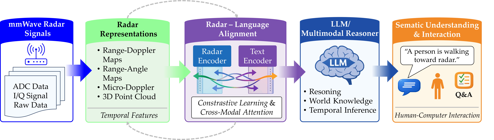

# 📡 Radar–Language Models (RLMs) Survey

Official repository for the survey manuscript:
**"Radar-Language Integration for Sensing Instrumentation: Signal Decoding, Measurement Uncertainty, and Multimodal Semantic Reasoning"**

**Authors**: The Tuan Trinh, Khoa Nguyen Dang, Xuanque Nguyen, Minhhuy Le*

---

## 📌 Abstract

Millimeter-wave (mmWave) and radar sensing instruments operate under severe physical constraints, where Range-Doppler-Angle (RDA) maps and 4D point clouds suffer from spatial sparsity, clutter backscatter, hardware non-idealities, and inherent signal measurement uncertainty. Recently, Radar-Language Models (RLMs) have emerged to address these instrumentation limitations, functioning as cognitive measurement decoders that couple physical electromagnetic feature extraction with Large Language Models (LLMs) and Vision-Language Models (VLMs) to translate raw radar measurements into semantically grounded physical parameters and natural language outputs. Unlike conventional deep-learning classifiers limited to closed-set categorical labels, RLMs project physical radar measurements into linguistic embedding spaces to perform open-set material property inference, spatial grounding, and adaptive instrumentation control. This paper presents a systematic survey reviewing 20 core RLM frameworks (2020–2026) alongside 3 background literature frameworks across 24, 60, and 77\,GHz FMCW and Ultra-Wideband (UWB) platforms, while strictly categorizing safety-only and image-only models as external background literature. We establish a three-axis taxonomy encompassing physical signal representations, cross-modal tokenization architectures, and measurement applications. Furthermore, we provide a critical trade-off analysis comparing signal tokenization information loss, spatial-temporal resolution bounds, and computational self-attention complexity ($O(N^2)$) on embedded edge processors. Crucially, we analyze measurement uncertainty propagation—tracing how phase noise, thermal noise, and antenna array mutual coupling impact LLM token probabilities and hallucination behavior. Finally, we outline key open challenges in hardware calibration drift, phase noise, and cross-frequency-band transferability, providing a strategic roadmap toward standardized, hardware-agnostic cognitive radar instrumentation.

**Index Terms**— *Millimeter-wave radar, FMCW radar, Radar-Language Models (RLMs), Cross-modal tokenization, Large language models, Multimodal semantic reasoning*

---

  
   
  <em>Overview of the Radar-to-Language pipeline. Raw mmWave radar signals are transformed into structured representations, aligned with language embeddings through multimodal learning, and processed by large language models to enable semantic perception, reasoning, and human-computer interaction.</em>

---

## 🎯 Primary Contributions

1. **Systematic Three-Axis Taxonomy & Scope Definition**: We establish a unified taxonomy categorizing 20 core RLMs across physical signal representations, cross-modal tokenization architectures, and measurement tasks, strictly separating physical models from text-only safety and optical baselines.
2. **Measurement Uncertainty Propagation (MUQ) Analysis**: We formulate how low-level physical measurement uncertainties (noise, phase jitter, ADC quantization) and hardware non-idealities (chirp non-linearity, mutual coupling, temperature drift) propagate through tokenizers into LLM token probabilities and hallucination behavior.
3. **Comparative Quantification of Tokenization Paradigms**: We evaluate trade-offs across VQ-VAE codebooks, continuous linear projections, and physics-informed RAG in terms of information loss, spatial-temporal resolution bounds, and edge self-attention complexity ($O(N^2)$).
4. **Open-Science Reproducibility Catalog**: We compile a catalog of public datasets, open code repositories, and metrics spanning measurement science (mAP, Detection Rate) and NLP generation (BLEU-4, Word Accuracy).
5. **Strategic Research Roadmap**: We delineate a multi-horizon roadmap addressing calibration drift, multi-user RF interference, and the UWB integration gap toward hardware-agnostic cognitive radar.

---

## 🗺️ Survey Structure

  
   
  <em>High-level organization of this survey on Radar–Language Models, presenting foundational background, a unified taxonomy, datasets and evaluation methodologies, critical challenges, and future research opportunities.</em>

---

## 🏗️ Cross-Modal Tokenization Paradigms Trade-Off Matrix

| Tokenization Paradigm | Primary Representation | Attention Complexity | Phase Noise / Jitter Sensitivity | Edge Real-Time Suitability |
| :--- | :--- | :--- | :--- | :--- |
| **Discrete Codebook (VQ-VAE)** | Discrete codebook indices ($k^* \in \{1..K\}$) | $O(L^2)$ ($L \ll N$ tokens) | **High** (Voronoi boundary flips $k^* \to k'$ under low SNR) | **High** ($>30$ FPS, compact quantized sequence length) |
| **Continuous Projection (FPN/Linear)** | Continuous embeddings ($\mathbf{h} \in \mathbb{R}^d$) | $O(N^2)$ ($N \approx 10^3$ points) | **Medium** (Continuous error propagation into soft prompt spaces) | **Low–Medium** (Self-attention memory bottleneck on edge GPUs) |
| **Physics-Informed RAG** | Distilled scalars ($\epsilon_r, \sigma$) + Prompts | $O(1)$ token overhead | **Low** (Bounded by front-end physical parameter estimator) | **High** (Minimal prompt tokens, zero raw tensor FLOPs) |

---

## 📊 Technical Comparison of Reviewed Radar-LLM Literature (2024–2026)

| Work | Year | Radar Modality | RF Band / Hardware | Representation | Task | Language Component |
| :--- | :---: | :--- | :--- | :--- | :--- | :--- |
| **Core Physical Radar-Language Models (RLMs)** | | | | | | |
| [Talk2Radar](https://arxiv.org/abs/2405.12821) | 2024 | 4D mmWave Radar | 77 GHz (TI AWR1843/AWA2243) | 4D Point Cloud | 3D Referring Expression | Alignment |
| [LLMCount](https://arxiv.org/abs/2409.16209) | 2024 | Stationary mmWave | 60/77 GHz (TI IWR6843) | micro-Doppler | Target Counting | Alignment |
| [RadarLLM-Motion](https://arxiv.org/abs/2504.09862) | 2025 | mmWave Radar | 60 GHz FMCW / POI Synth | Point Cloud Seq. | Human Motion Understanding | Agentic Reasoning |
| [RadarPLM](https://arxiv.org/abs/2509.12089) | 2025 | Marine Radar | 9.4 GHz X-band (IPIX Radar) | Signal / Images | Target Detection | Alignment |
| [Marine Radar LLM](https://doi.org/10.1109/IGARSS55030.2025.11313965) | 2025 | Marine Radar | 9.4 GHz Dual-Pol X-band | Signal / Images | Target Detection | Alignment |
| [Multimodal ISAC LLM](https://doi.org/10.1109/MCOM.004.2400281) | 2025 | Multimodal ISAC | Sub-6 GHz / 28 GHz ISAC | Waveforms / Bits | Integrated Sensing/Comm | Agentic Reasoning |
| [LLMaterial](https://doi.org/10.1145/3714394.3756289) | 2025 | Radar Signals | 77 GHz FMCW (TI AWR1843) | Signatures ($\epsilon_r$, RCS) | Material Identification | Agentic Reasoning |
| [Robotic Material Perception](https://doi.org/10.1145/3680207.3765653) | 2025 | Radar + Vision | 77 GHz mmWave + RGB | Point Cloud / RGB | Material Perception | Agentic Reasoning |
| [mmPencil](https://doi.org/10.1145/3749504) | 2025 | mmWave Radar | 60 GHz FMCW (TI IWR6843ISK) | Trajectories | In-air Handwriting | Alignment / Generation |
| [WirelessGPT](https://doi.org/10.1109/JSAC.2025.3640156) | 2025 | Wireless / ISAC | 28 GHz / Sub-6 GHz Array | Waveforms | Multi-task ISAC Foundation | Generation |
| [MmExpert](https://doi.org/10.1145/3704413.3764420) | 2025 | mmWave Radar | 77 GHz FMCW (TI AWR1843) | Heatmaps / Raw | Data Synthesis/Understand | Gen. / Agentic Reasoning |
| [Radar2Text](https://doi.org/10.1109/IMBioC63524.2025.10989725) | 2025 | mmWave Radar | 77 GHz FMCW Sensor | Signatures / Spectra | Linguistic Summarization | Generation |
| [IoT ISAC LLM](https://doi.org/10.1109/MIOT.2025.3575888) | 2025 | IoT / ISAC | Sub-6 GHz / 60 GHz IoT | Sensing Data | Network Orchestration | Agentic Reasoning |
| [M2BeamLLM](https://arxiv.org/abs/2506.14532) | 2025 | mmWave | 60 GHz (DeepSense 6G Unit) | Beam Patterns | Beam Prediction | Alignment / Generation |
| [SAR Image Captioning](https://doi.org/10.1109/JSTARS.2025.3603036) | 2025 | SAR (Satellite) | C/X-band SAR (Gaofen-3) | SAR Images | Image Captioning | Generation |
| [Jamming VLM](https://doi.org/10.1109/TAES.2025.3586834) | 2025 | Electronic Warfare | 1–18 GHz EW Spectrograms | Spectrograms | Jamming Recognition | Alignment (VLMs) |
| [Sig2text](https://arxiv.org/abs/2503.15213) | 2025 | Non-coop. Radar | 0.5–18 GHz EW Receiver | Pulse / Signal | Radar Signal Parsing | Generation |
| [Signal Deinterleaving](https://doi.org/10.3390/s26010248) | 2026 | Pulse Radar Signal | Non-coop. Pulse Stream | Pulse (PRI) Stream | Signal Deinterleaving | Reasoning / Generation |
| [RFSensingGPT](https://doi.org/10.1109/TCCN.2025.3558069) | 2026 | RF / 6G Networks | Sub-6 GHz / mmWave 6G | Signal Features | RAG-enhanced Sensing | Gen. / Agentic Reasoning |
| [SARLANG-1M](https://doi.org/10.1109/TGRS.2026.3652099) | 2026 | SAR (Satellite) | C-band SAR (Sentinel-1) | SAR Images | Signal Understanding | Alignment / Generation |
| **External Background Literature** | | | | | | |
| [RADAR (Safety)](https://arxiv.org/abs/2509.25271)† | 2025 | N/A (Safety) | N/A (Text Prompts) | Textual / Logic | LLM Safety Evaluation | Agentic Reasoning |
| [Radar NLP Trends](https://doi.org/10.1109/MAES.2025.3533946)† | 2025 | General Radar | Multi-band Radar | Signals / Texts | Review: NLP Trends | Alignment / Generation |
| [RADAR (Fake Image)](https://doi.org/10.3390/technologies13070280)† | 2025 | N/A (Image-based) | Optical Camera | Semantic Features | Fake Image Detection | Agentic Reasoning |

*\*† Categorized as external background literature as defined by the operational scope criteria in Section I.*

---

## 📚 Categorized Paper Catalog

### 2024
* [**Talk2Radar: Bridging Natural Language with 4D mmWave Radar for 3D Referring Expression Comprehension**](https://arxiv.org/abs/2405.12821) — R. Guan et al. [[Code]](https://github.com/GuanRunwei/Talk2Radar)
* [**LLMCount: Enhancing Stationary mmWave Detection with Multimodal-LLM**](https://arxiv.org/abs/2409.16209) — B. Li et al.

### 2025
* [**RadarLLM: Empowering Large Language Models to Understand Human Motion from Millimeter-Wave Point Cloud Sequence**](https://arxiv.org/abs/2504.09862) — Z. Lai et al. [[Code]](https://github.com/Inowlzy/RadarLLM)
* [**RadarPLM: Adapting Pre-trained Language Models for Marine Radar Target Detection by Selective Fine-Tuning**](https://arxiv.org/abs/2509.12089) — Q. Hu
* [**When Marine Radar Target Detection Meets Pre-trained Large Language Models**](https://doi.org/10.1109/IGARSS55030.2025.11313965) — Q. Hu et al.
* [**Large Language Models Empower Multimodal Integrated Sensing and Communication**](https://doi.org/10.1109/MCOM.004.2400281) — L. Cheng et al.
* [**Can Large Language Models Identify Materials from Radar Signals?**](https://doi.org/10.1145/3714394.3756289) — J. Zhu, H. Deng, and H. Chen
* [**Radar-Enhanced Robotic Material Perception with Vision Language Models**](https://doi.org/10.1145/3680207.3765653) — H. Deng, J. Zhu, and H. Chen
* [**mmPencil: Toward Writing-Style-Independent In-Air Handwriting Recognition via mmWave Radar and Large Vision-Language Model**](https://doi.org/10.1145/3749504) — Y. Guo et al. [[Dataset]](https://www.kaggle.com/datasets/mmpencil/mmpencil-dataset)
* [**WirelessGPT: A Generative Foundation Model for Multi-Task Integrated Sensing and Communication**](https://doi.org/10.1109/JSAC.2025.3640156) — T. Yang et al.
* [**MmExpert: Integrating Large Language Models for Comprehensive mmWave Data Synthesis and Understanding**](https://doi.org/10.1145/3704413.3764420) — Y. Yan et al.
* [**Radar2Text: Generation of Linguistic Summary from mmWave Radar Signatures Using Fine-Tuned Multimodal Language Models**](https://doi.org/10.1109/IMBioC63524.2025.10989725) — K. E. O. Jauregui and D. V. D. Q. Rodrigues
* [**Multi-Modal Integrated Sensing and Communication in Internet of Things with Large Language Models**](https://doi.org/10.1109/MIOT.2025.3575888) — A. Liu et al.
* [**M2BeamLLM: Multimodal Sensing-Empowered mmWave Beam Prediction with Large Language Models**](https://arxiv.org/abs/2506.14532) — C. Zheng et al. [[Data]](https://deepsense6g.net/)
* [**Multimodal Large Models Driven SAR Image Captioning: A Benchmark Dataset and Baselines**](https://doi.org/10.1109/JSTARS.2025.3603036) — Z. Gao et al.
* [**Few-Shot and Zero-Shot Radar Active Jamming Recognition Based on a Vision-Language Model**](https://doi.org/10.1109/TAES.2025.3586834) — X. Cao
* [**Sig2Text: A Vision-Language Model for Non-Cooperative Radar Signal Parsing**](https://arxiv.org/abs/2503.15213) — H. Feng et al. [[Code]](https://github.com/Na-choneko/sig2text)
* [**Emerging Trends in Radar: Natural Language Processing**](https://doi.org/10.1109/MAES.2025.3533946) — R. M. Narayanan et al. *(Background Literature)*
* [**RADAR: A Risk-Aware Dynamic Multi-Agent Framework for LLM Safety Evaluation via Role-Specialized Collaboration**](https://arxiv.org/abs/2509.25271) — X. Chen et al. *(Background Literature)*
* [**RADAR: Reasoning AI-Generated Image Detection for Semantic Fakes**](https://doi.org/10.3390/technologies13070280) — H. Wang et al. *(Background Literature)*

### 2026
* [**The Intelligent Evolution of Radar Signal Deinterleaving: A Systematic Review from Foundational Algorithms to Cognitive AI Frontiers**](https://doi.org/10.3390/s26010248) — Z. Qu, J. Zhang, Y. Zhou, and L. Ni
* [**RFSensingGPT: A Multi-Modal RAG-Enhanced Framework for Integrated Sensing and Communications Intelligence in 6G Networks**](https://doi.org/10.1109/TCCN.2025.3558069) — M. Z. Khan et al.
* [**SARLANG-1M: A Benchmark for Vision-Language Modeling in SAR Image Understanding**](https://doi.org/10.1109/TGRS.2026.3652099) — Y. Wei et al.

---

## 💾 Representative Public Datasets & Repositories

| Dataset / Framework | Radar Representation | Primary Scenario | Task | Public Code & Data |
| :--- | :--- | :--- | :--- | :--- |
| **Talk2Radar** | 4D mmWave point clouds + LiDAR | Urban traffic / outdoor driving | 3D REC (Grounding) | [GitHub Repo](https://github.com/GuanRunwei/Talk2Radar) |
| **mmPencil** | 60 GHz 3D trajectory images | Indoor office | In-air handwriting | [Kaggle Dataset](https://www.kaggle.com/datasets/mmpencil/mmpencil-dataset) |
| **RadarLLM-Motion** | 4D mmWave point cloud sequences | Human motion capture | Motion understanding | [GitHub Repo](https://github.com/Inowlzy/RadarLLM) |
| **M²BeamLLM** | 77 GHz Range-Angle Maps + GPS + LiDAR | V2I Communication | mmWave Beam Prediction | [DeepSense 6G](https://deepsense6g.net/) |
| **Sig2text** | STFT Magnitude Spectrograms | Non-cooperative Intercept (EW) | Symbolic modulation parsing | [GitHub Repo](https://github.com/Na-choneko/sig2text) |
